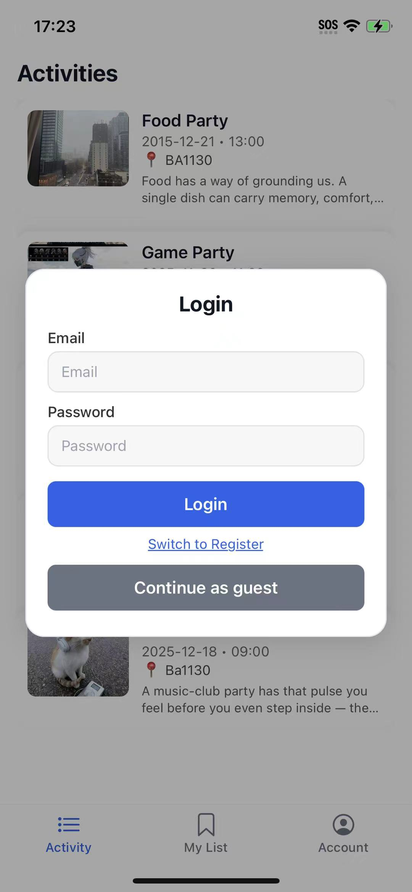
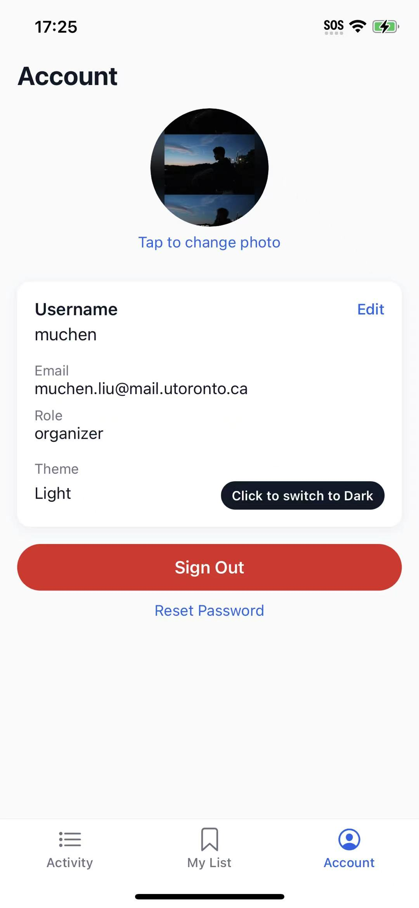
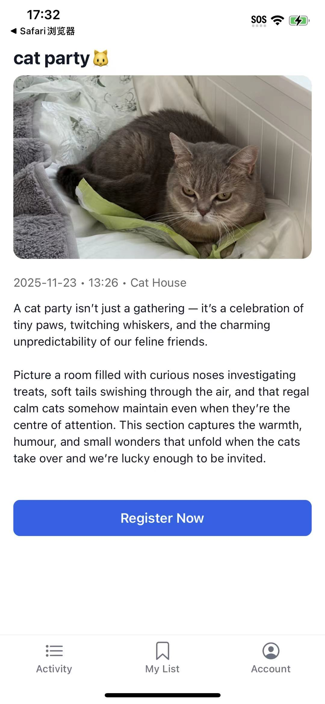
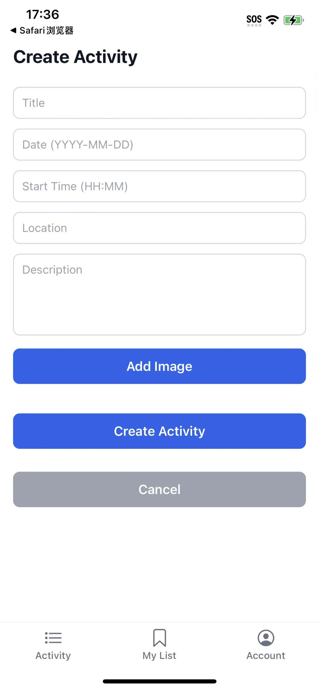

# UConnect – Final Project Report

_A mobile event management app for the University of Toronto community_

## Team Information

| Name        | Student Number | Email                             |
|------------|----------------|-----------------------------------|
| Muchen Liu | 1006732145     | muchen.liu@mail.utoronto.ca       |
| Jerry Chen | 1006944899     | jianuojerry.chen@mail.utoronto.ca |
| Ziyan Liu  | 1011801926     | zycathy.liu@mail.utoronto.ca      |
| Spiro Li   | 1012635427     | supeng.li@mail.utoronto.ca        |

---

## Motivation

The University of Toronto is a large institution with three campuses and over 150,000 students. Each year, hundreds of student clubs, academic departments, and external organizations host events such as workshops, networking nights, sports sessions, competitions, and career fairs. Despite this vibrant campus life, many students struggle to stay informed because event information is scattered across multiple disconnected platforms. Each faculty or organization uses its own communication channel, leading to poor cross-departmental coordination and inconsistent outreach.

Existing systems such as Quercus announcements or department-managed social media pages are insufficient. Quercus rarely highlights events from external organizations, while social media platforms lack a dedicated notification mechanism for students, making event discovery fragmented and unreliable.

To support a more connected student experience, our team built **UConnect**, a React Native mobile application designed to centralize campus event information and bridge communication gaps between organizations and students. UConnect provides a unified, intuitive platform that allows students to easily browse events, register with one tap, and receive reminders. For organizers, it offers a complete event management workflow including creation, editing, participant management, and real-time notifications.

By integrating these features, UConnect aims to foster a more dynamic, accessible, and engaging campus community, empowering students to participate more actively and helping organizations reach broader audiences.

---

## Objectives

UConnect was designed to achieve four key objectives:

1. **Centralize event discovery** across campus by aggregating all activities in one mobile interface.
2. **Streamline event registration** for students through one-tap sign-ups, reminders, and personal lists.
3. **Provide organizations with efficient tools** to create, edit, and manage their events, including visual updates and participant tracking.
4. **Enable real-time communication** through push notifications—alerting students about updates and helping organizers stay informed about registrations.

Together, these objectives support a unified ecosystem that enhances student engagement and improves operational efficiency for campus groups.

---

## Technical Stack

UConnect is built using modern, scalable, mobile-friendly technologies.

### Frontend

- **React Native + Expo (TypeScript)**  
  Enables cross-platform development for iOS and Android using native UI components.

- **Expo Router**  
  Provides file-based navigation and typed route parameters for a predictable navigation structure.

- **Redux Toolkit**  
  Manages global application state including authentication, profile data, activity lists, and refresh triggers.

- **Expo Notifications**  
  Used for local and remote push notifications to keep users informed about event reminders and updates.

### Backend

- **Supabase (PostgreSQL + API)**  
  Handles:
  - Authentication (email/password, user metadata)  
  - Activity storage and retrieval  
  - Registration records  
  - Image uploads via Supabase Storage  
  - User profile management and Expo push tokens  

### Other Key Technologies

- **AsyncStorage** (through Redux persistence, where appropriate)  
  Ensures parts of the app persist across reboots (e.g., user session).

- **Expo ImagePicker**  
  Allows organizers to upload event images from their devices.

---

## **Features**

### **Student Features**

UConnect opens with an Activity feed that streams Supabase-hosted events into responsive ActivityCard tiles, giving students imagery, dates, times, and locations in a single scroll. Tapping any card reveals an immersive detail page where galleries, logistics, and role-aware actions live side by side, enabling one-tap registration that writes to Supabase, gracefully handles duplicate attempts, and schedules an Expo local reminder thirty minutes before the start time. Because each profile stores an Expo push token, the app can also deliver remote alerts whenever an organizer updates an activity, ensuring last-minute changes reach every registered student. The “My List” tab queries registrations directly, listens to the shared refresh flag, and keeps its contents synced whenever the screen regains focus, so students always see the latest attendance state after registering or cancelling.

### **Organizer Features**

Organizers authenticate with metadata-stamped Supabase accounts to unlock the creation and editing workflow housed in `app/organizer/create.tsx`. The form combines native date/time pickers, multi-image uploads backed by Supabase Storage, validation for required logistics, and AppButton actions that persist changes before toggling the Redux refresh flag so shared feeds update for every user. Viewing an event while signed in as its organizer automatically surfaces an edit shortcut, and the organizer-specific My List filters activities by `organizer_id` so they can monitor what they have published. Each create or update operation triggers push confirmations to the organizer, and the activities service fans out additional notifications whenever students register or cancel, including live registration counts that make capacity planning easier without ever leaving the mobile app.

### **Cross-Functional Features**

Cross-cutting features keep both roles coordinated through a single Expo Router tab shell that supports deep links such as `uconnect://reset-password`, allowing password-reset flows to land inside the native stack while still letting guests browse anonymously via the LoginModal. Supabase Auth enforces email verification, role metadata, and session persistence, while the account screen lets authenticated users edit usernames, upload avatars into Supabase Storage, toggle the global light/dark theme (persisted with AsyncStorage), and trigger password reset emails. The root layout centralizes notification setup by requesting permissions, registering Expo push tokens, and storing them in Redux so confirmations, reminders, and organizer alerts continue to arrive even when the app is backgrounded. Combined with the activity refresh slice and globally shared theme state, these platform-level capabilities ensure every tab stays in sync, role-appropriate UI is enforced, and media-heavy event content renders consistently across iOS, Android.

---

## User Guide

### 1. Authentication and Onboarding

When the app is opened for the first time, a login modal appears (see screenshot). If a user does not have an account, they must first register by tapping **“Switch to Register.”**

During registration, the user must:

- Enter an email and password.  
- Select a role: **Student** or **Organizer** (this role is permanent and cannot be changed after registration).  

After submitting the form, the user will receive a verification email containing a confirmation link. They must open the link to complete their account activation. Only after verification can they log in with their email and password.

_Image:_  


### 2. Account Management

On the **Account** page, users can:

- Edit their profile photo.  
- Update their username.  
- Switch between dark mode and light mode.  

Users may also reset their password by tapping **“Reset Password.”**

- A password reset email will be sent to them.  
- When they tap the link, they are redirected back into the app’s Reset Password page, where they can enter a new password and then log in again using the updated credentials.

_Image:_  


### 3. Student Features

#### Browsing Activities

Students can browse all available events on the **Activity** page. By tapping any activity, they can view its full details, including:

- Title  
- Date and start time  
- Location  
- Images  
- Full introduction/description  

#### Registering for an Activity

At the bottom of the activity details page, students will find a **“Register Now”** button.

- After registering, the activity will appear on the **My List** page.  
- The button will change to **“Cancel Registration,”** allowing students to withdraw.  
- Notifications are sent automatically (e.g., reminders before the event or organizer updates).  
- A local notification is scheduled automatically for students 30 minutes before the registered activity begins.  
- When a student registers, the organizer receives a push notification:  
  > "A new student registered for {title}. Total registered: X."

_Image:_  


### 4. Organizer Features

#### Creating Activities

Organizer accounts have additional controls on the **My List** page. A button labeled **“+ Create New Activity”** allows organizers to create new events. They can input all the activity information, including images.

Once submitted, the activity will appear on both:

- The **Activity** page (visible to students).  
- The organizer’s **My List** page.

_Image:_  


#### Editing Activities

Organizers can only edit activities they created themselves.

- By opening an event they own, they will see an **“Edit Activity”** button at the bottom of the details page.  
- After modifying and saving changes:
  - The organizer receives a confirmation push notification:  
    > "You successfully modified activity: {title}"  
  - All registered students receive a push notification:  
    > "{title} has been updated. Please check the details."

---


## Development Guide

This section describes how to set up the UConnect development environment, configure the backend, and run the app locally.

### 1. Prerequisites

Before cloning the project, make sure the following are installed:

- Node.js (LTS version) and npm or yarn.  
- Git.  
- Expo tooling:

  ```bash
  npm install -g expo-cli
  ```

- A test device or emulator:
  - iOS / Android device with the Expo Go app installed, **or**  
  - Android emulator / iOS simulator configured through Android Studio / Xcode.

### 2. Clone the Repository and Install Dependencies

Clone the GitHub repository:

```bash
git clone <repo-url>
cd UConnect
```

Install dependencies using Expo (this ensures compatible versions of native packages are installed):

```bash
npx expo install
```

This will install React Native, Expo, Expo Router, Redux Toolkit, Supabase client, Expo Notifications, and other required libraries.

### 3. Set Up Supabase Backend

#### Create a New Project

1. Go to Supabase and log in.  
2. Click **New project**.  
3. Choose an organization, give the project a name (e.g., `UConnectClone`), set a database password, and wait until provisioning finishes.

#### Create Storage Buckets

In the Supabase dashboard:

1. Go to **Storage → Buckets**.  
2. Create two **public** buckets:
   - `profile-photos`  
   - `activity-images`  

These buckets store user avatars and activity images, respectively.

#### Enable Email/Password Auth

1. Go to **Authentication → Providers** (or **Settings**).  
2. Enable **Email / Password** sign-in.  
3. In the Site URL / redirect settings, add the app deep-link (e.g., `uconnect://`) so email verification and password reset links can redirect back into the app.

#### Create Database Tables and Policies

1. In the Supabase project, go to **SQL → New query**.  
2. Open the [schema.sql](schema.sql) file in the project and copy its contents.  
3. Paste the SQL into the editor and run it.

This script creates the `activities`, `profiles`, and `registrations` tables and sets the row-level security (RLS) policies for profiles, registrations, and storage, including read/write access for activity images and profile photos.

### 4. Configure Environment Variables

In the project root, create a `.env` file and add your Supabase credentials:

```bash
EXPO_PUBLIC_SUPABASE_URL=https://<your-project>.supabase.co
EXPO_PUBLIC_SUPABASE_ANON_KEY=<your-anon-key>
```

These values can be copied from **Project Settings → API** in the Supabase dashboard. The Expo app reads them via `process.env.EXPO_PUBLIC_SUPABASE_URL` and `process.env.EXPO_PUBLIC_SUPABASE_ANON_KEY`.

### 5. Running the App Locally

Start the Expo development server:

```bash
npx expo start
```

Open the QR code with Expo Go on your phone, or press the appropriate key in the CLI to launch the Android emulator or iOS simulator.

Once the app loads, you can:

- Register as a student or organizer (registration creates a Supabase user and a profile row).  
- Create, update, and delete activities (organizer role).  
- Browse activities and register / cancel registration (student role).  
- Test push notifications (local reminders and organizer / student alerts).

### 6. Local Testing Notes

- To fully test authentication flows (email verification and password reset), you must use real email addresses and follow the links from Supabase, which will deep-link back into the app using the `uconnect://` scheme.  
- If you change the Supabase schema or RLS policies, re-run or adjust the SQL in `schema.sql` to keep your local database consistent with the project expectations.  
- For repeat testing, you can clear app data in Expo Go or sign out inside the Account tab to simulate a new user.

---

## Deployment Information

The final production build of UConnect was deployed using Expo EAS Build. The Android build (APK) is available through Expo’s hosted build service:

Expo Build Link:
https://expo.dev/accounts/ece1778uconnect/projects/uconnect/builds/b82f7290-5185-477f-865a-a630017e1205

This link provides access to the downloadable artifact generated by Expo during the EAS build process. The build can be installed on compatible Android devices for testing or demonstration purposes.

---

## Individual Contributions

### Muchen Liu

Implemented the core app functionality, including event creation and editing, Supabase integration, user authentication, event detail views, registration logic, My List state refresh, and push notification flow. Designed and wired up the overall app architecture and database queries using Expo Router and Supabase.

### Jerry Chen

Jerry finished the `ActivityCard` component and implemented the layout and core functions for the **My List** page, including activity registration, page updates, and corresponding data interaction with Supabase.

### Spiro Li

Spiro spearheaded the notification system by scheduling 30-minute local reminders for newly created and registered activities, and wiring push fan-out so that organizers and registered students automatically receive the correct updates and registration alerts, and also streamlined login authentication.

### Ziyan Liu

Ziyan implemented the overall UI/UX polish across the app, including the Account page, Activity feed, Event details, and organizer create/edit screens, added a global persistent light/dark theme with updated tab bar icons, and refined the login/register modal (role selection, error prompts) while assisting with configuration and deployment debugging to ensure a stable, testable Android build.


---


## Lessons Learned and Concluding Remarks

Building UConnect gave our team hands-on experience with designing and shipping a real mobile app from end to end. We learned how important it is to plan a clear data model early, especially when supporting roles (student vs. organizer), registrations, and notifications. This project also clarified the boundary between Supabase as the single source of truth and Redux as UI/state glue, which made the architecture cleaner and easier to debug.

Implementing role-based access (organizers can only edit their own events) and Expo push notifications taught us how real apps handle security, permissions, and asynchronous updates. We also experienced the very real difference between “it works in Expo Go” and “it works in a production build,” and learned to test on actual devices early.


---


## Video Demo

Click the link here to watch the demo video.
